<div align="center">

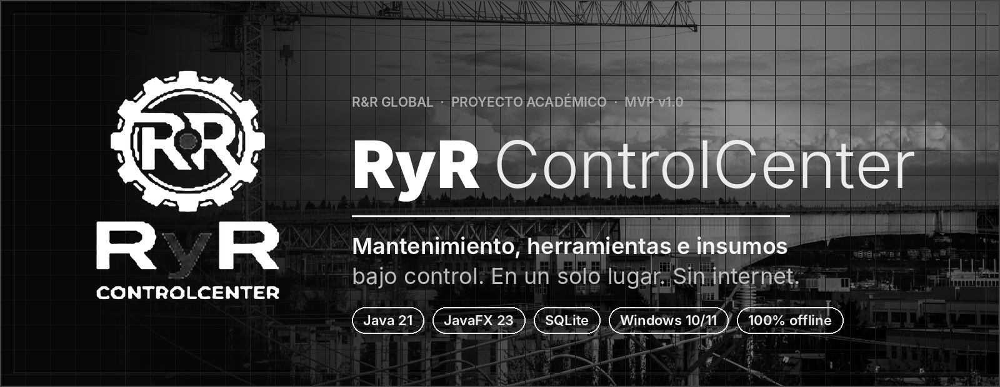

<br>


**Sistema de información de escritorio para controlar el mantenimiento, las herramientas y los insumos de una operación industrial.**

[Qué es](#-qué-es) · [Funcionalidades](#-funcionalidades) · [Vistas](#-vistas-de-la-aplicación) · [Arquitectura](#-arquitectura) · [Modelo de datos](#-modelo-de-datos) · [Instalación](#-instalación-y-ejecución) · [Equipo](#-equipo)

</div>

<br>

---

## ▌ Qué es

**RyR ControlCenter** reemplaza las hojas de cálculo con las que hoy se lleva el control del almacén y del mantenimiento: lentas, propensas a errores y sin trazabilidad. En una sola aplicación de escritorio, **100 % offline**, se gestiona:

- la **matriz máquina–filtro** (qué filtro OEM lleva cada equipo),
- los **préstamos y devoluciones** de herramientas, equipos y kits, con inspección SST,
- el **inventario de insumos** con movimientos de **Kárdex** y alertas de reposición,
- un **dashboard gerencial** con indicadores y exportación a PDF / Excel,
- **usuarios, roles y una bitácora de auditoría** de cada acción crítica.

Nació como un ejercicio académico inspirado en un caso real, **RyR Global**: una operación con **500 a 650 herramientas** y un catálogo de **90 a 120 referencias de filtros**, donde el seguimiento manual genera desorden, pérdida de información y demoras en la atención de los equipos. El alcance es un **MVP funcional** construido en un semestre (8 semanas) por un equipo de seis personas, validado con la cliente.

<br>

<div align="center">

</div>

<br>

---

## ▌ Funcionalidades

<table>
<tr>
<td width="50%" valign="top">

### ◼ Matriz máquina–filtro
Ficha técnica de cada máquina (marca, modelo, serie, horómetro, área) y su juego exacto de filtros por sistema — **aceite, aire, combustible, hidráulico y refrigerante** — con su código **OEM** y el filtro del catálogo asociado.

### ◼ Préstamos y devoluciones
Salida de **herramienta única, maquinaria o kit completo** vinculada al operario (nombre y cédula) y al frente de trabajo. Cada préstamo registra la fecha estimada de devolución y las observaciones de la inspección SST de salida; al devolver se documenta el **estado físico** del elemento.

### ◼ Inventariado
Registro general de **maquinaria, herramientas y kits agrupados**, con estado SST (`Operativa`, `Bloqueada`, `Mantenimiento`, `Completo`), ubicación y observaciones. Los kits se componen de herramientas del propio inventario.

</td>
<td width="50%" valign="top">

### ◼ Insumos y Kárdex
Entradas, salidas y ajustes por conteo físico con **saldo resultante** en cada movimiento. Tres pestañas: movimientos, existencias y reposición, y **gráficas** (entradas/salidas por mes, semáforo, insumos más activos, stock vs. punto de reorden).

### ◼ Semáforo de existencias
Alerta visual automática según el **punto de reorden** configurable de cada insumo.

### ◼ Dashboard gerencial
Máquinas, herramientas, insumos, préstamos activos, devoluciones, ocupación del inventario rotativo, aprobados SST, bloqueados / en mantenimiento y **actividad mensual**.

### ◼ Reportes PDF y Excel
Exporta Kárdex, existencias y dashboard. Los escritores de **PDF y XLSX están hechos a la medida**, sin librerías de terceros.

### ◼ Usuarios y bitácora auditora
Alta y control de usuarios, y registro con fecha, hora y responsable de las acciones críticas de cada módulo.

</td>
</tr>
</table>

### Semáforo de existencias

| Nivel | Condición |
|:--|:--|
| ● **Rojo** — reponer | Agotado o por debajo del punto de reorden |
| ◐ **Amarillo** — pedir pronto | En el punto de reorden o hasta 25 % por encima |
| ○ **Verde** — OK | Por encima del margen de seguridad |

### Ciclo de vida de un préstamo

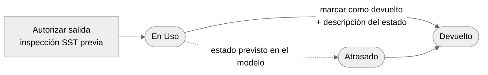

El dashboard contabiliza los préstamos `En Uso` y `Atrasado` como **préstamos activos**.

<br>

---

## ▌ Vistas de la aplicación

> **Nota:** las imágenes de esta sección son marcos de referencia en blanco y negro. Reemplázalas con capturas reales conservando el nombre del archivo (ver [Cómo agregar capturas reales](#-cómo-agregar-capturas-reales)).

<table>
<tr>
<td width="50%" align="center">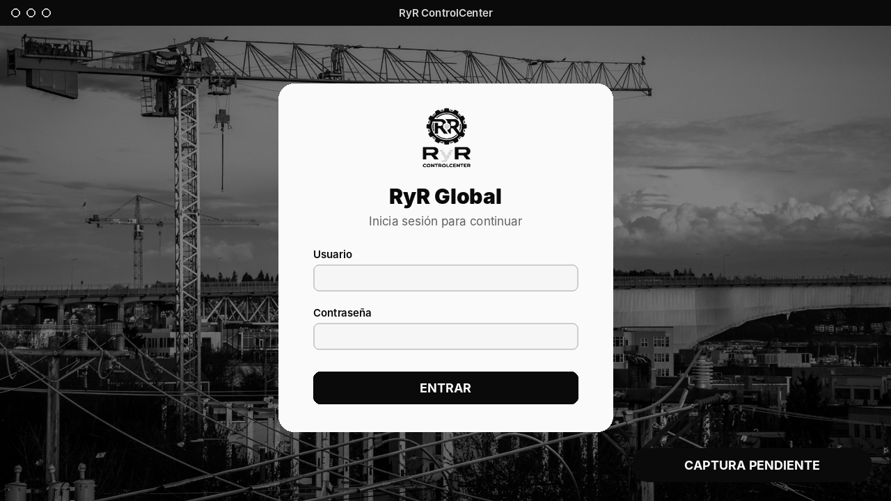<br><b>Inicio de sesión</b><br><sub>Autenticación con usuario y contraseña</sub></td>
<td width="50%" align="center">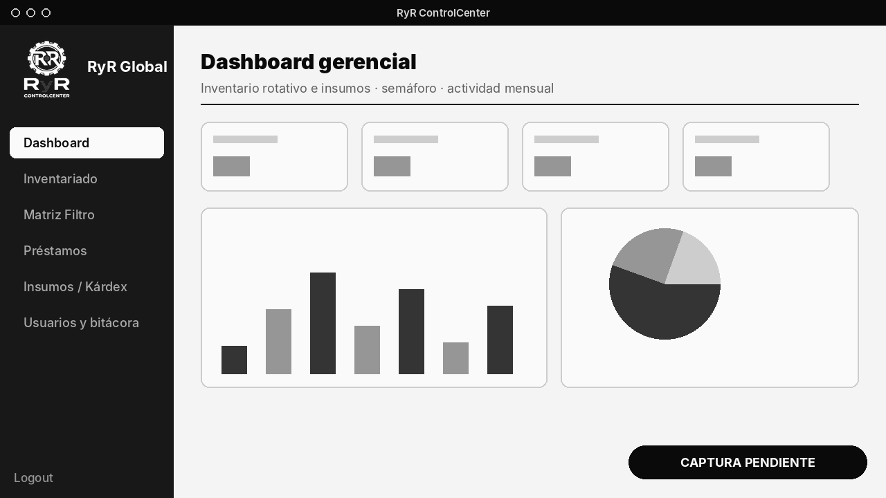<br><b>Dashboard gerencial</b><br><sub>Indicadores, semáforo y actividad mensual</sub></td>
</tr>
<tr>
<td width="50%" align="center">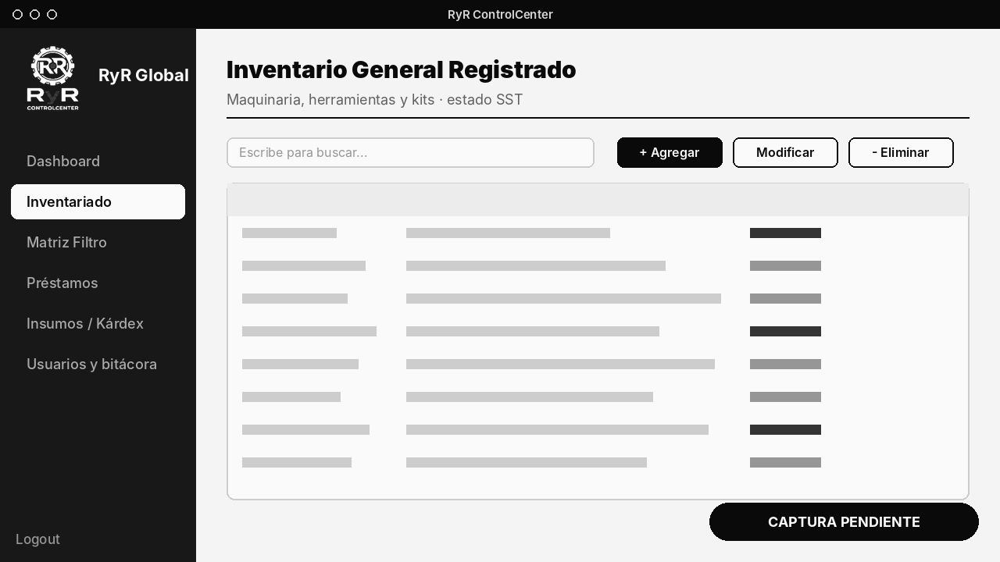<br><b>Inventariado</b><br><sub>Maquinaria, herramientas y kits</sub></td>
<td width="50%" align="center">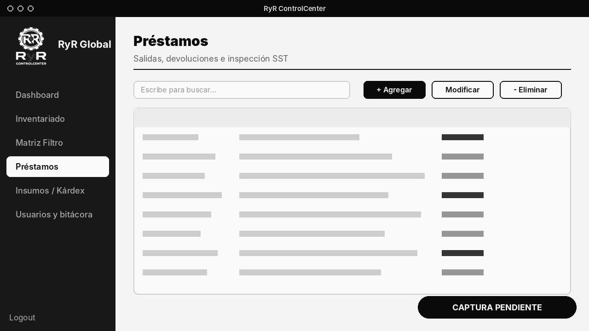<br><b>Préstamos</b><br><sub>Salidas, devoluciones e inspección SST</sub></td>
</tr>
<tr>
<td width="50%" align="center">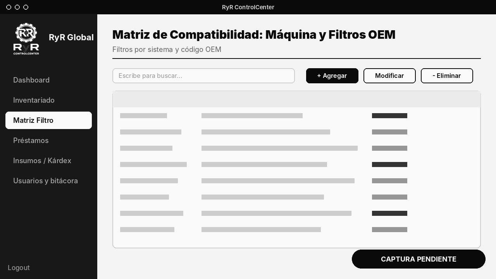<br><b>Matriz máquina–filtro</b><br><sub>Compatibilidad por sistema y código OEM</sub></td>
<td width="50%" align="center">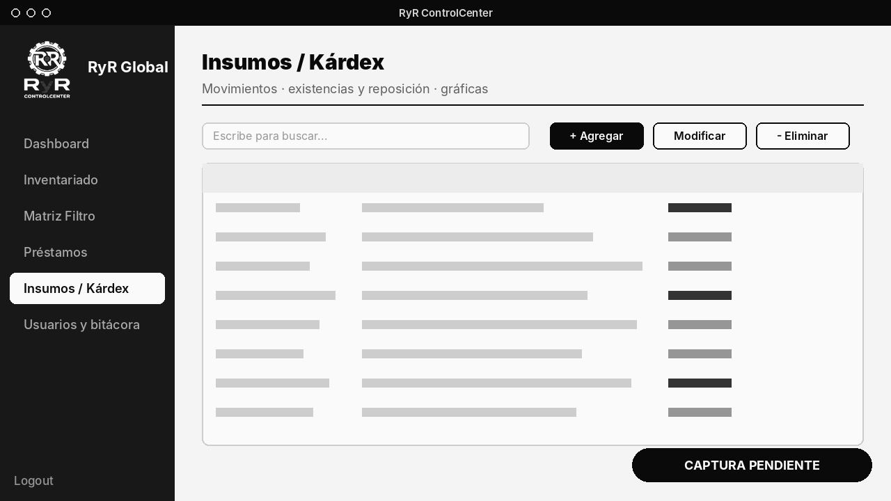<br><b>Insumos / Kárdex</b><br><sub>Movimientos, existencias y gráficas</sub></td>
</tr>
<tr>
<td colspan="2" align="center">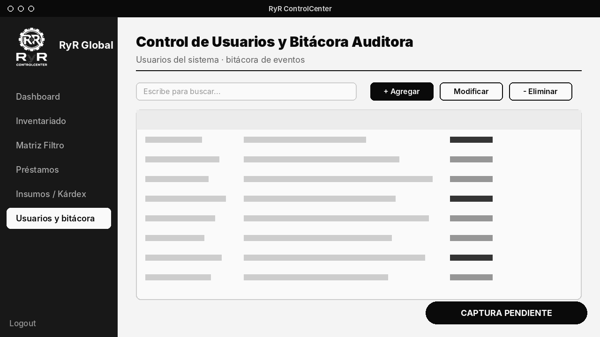<br><b>Usuarios y bitácora</b><br><sub>Control de usuarios y registro auditor de eventos</sub></td>
</tr>
</table>

Todas las vistas comparten una **barra lateral de navegación** (Dashboard · Inventariado · Matriz Filtro · Préstamos · Insumos / Kárdex · Usuarios y bitácora) y el cierre de sesión.

<br>

---

## ▌ Roles y permisos

El acceso exige usuario y contraseña. Los permisos de escritura dependen del rol de la sesión:

| Módulo | Auxiliar | Administrador |
|:--|:--:|:--:|
| Dashboard | ✔ consulta | ✔ consulta |
| Inventariado | ✔ edita | consulta |
| Matriz máquina–filtro | ✔ edita | consulta |
| Insumos / Kárdex (registrar movimientos) | ✔ edita | consulta |
| Usuarios y bitácora | ✔ edita | consulta |
| Préstamos | ✔ opera | ✔ opera |

> La edición está habilitada únicamente para el rol `Auxiliar` (`SesionActual.puedeEditar()`), que se valida en Inventariado, Matriz filtro, Kárdex y Usuarios y bitácora.

<br>

---

## ▌ Arquitectura

Aplicación de escritorio en capas — **MVC + DAO** — que lee y escribe directamente sobre una base SQLite embebida. Sin servidor, sin nube, sin red.

<div align="center">
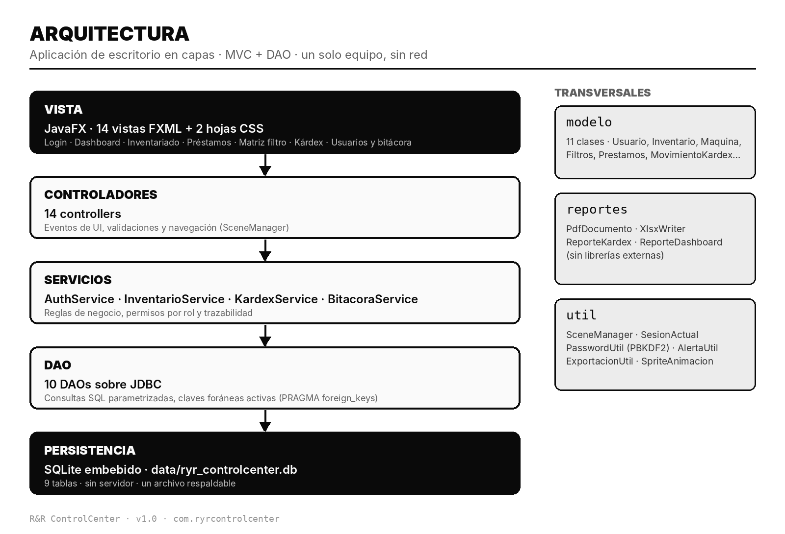
</div>

```
src/main/
├── java/com/ryrcontrolcenter/
│   ├── MainApp.java            punto de entrada (JavaFX)
│   ├── config/                 ConexionBD  → JDBC + PRAGMA foreign_keys
│   ├── controller/             14 controladores de las vistas
│   ├── service/                Auth · Inventario · Kardex · Bitacora
│   ├── dao/                    10 DAOs (SQL parametrizado)
│   ├── modelo/                 11 clases de dominio
│   ├── reportes/               PdfDocumento · XlsxWriter · ReporteKardex · ReporteDashboard
│   └── util/                   SceneManager · SesionActual · PasswordUtil · AlertaUtil …
└── resources/com/ryrcontrolcenter/
    ├── ui/                     14 vistas .fxml + dashboard.css + kardex.css
    └── images/                 logo, fondo del login y animaciones
```

<br>

---

## ▌ Modelo de datos

Nueve tablas relacionales en `data/ryr_controlcenter.db`, con **claves foráneas activas**, restricciones `CHECK` en los estados y **eliminación lógica** (`visible`) en inventario, matriz y préstamos.

<div align="center">
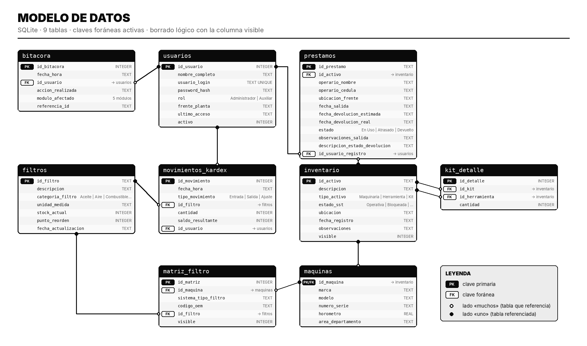
</div>

<br>

---

## ▌ Seguridad y trazabilidad

| | |
|:--|:--|
| **Contraseñas** | Nunca se guardan en claro: hash **PBKDF2-HMAC-SHA256**, 600 000 iteraciones, salt aleatorio de 16 bytes y comparación en tiempo constante |
| **Control de acceso** | Permisos de escritura por rol, validados en la capa de servicio y de controlador |
| **Bitácora** | Cada acción crítica queda con **fecha, hora, usuario, módulo y referencia** (`Préstamos`, `Inventariado`, `Insumos/Kardex`, `Matriz Filtro`, `Usuarios y Bitacora`) |
| **Integridad** | Claves foráneas activas; los movimientos de Kárdex se ejecutan en una **transacción** (`commit` / `rollback`) y SQLite conserva los datos confirmados ante un cierre inesperado |
| **Respaldo** | Al ser un único archivo local, la base se respalda copiando `data/ryr_controlcenter.db` |

<br>

---

## ▌ Stack tecnológico

| Capa | Tecnología |
|:--|:--|
| Lenguaje | **Java 21** |
| Interfaz | **JavaFX 23.0.1** (`javafx-controls`, `javafx-fxml`) · FXML + CSS |
| Base de datos | **SQLite** vía `sqlite-jdbc 3.46.1.0` |
| Registro | `slf4j-simple 2.0.13` |
| Construcción | **Maven** · `javafx-maven-plugin 0.0.8` |
| Reportes | Generadores propios de **PDF** y **XLSX** |

<br>

---

## ▌ Instalación y ejecución

**Requisitos**

- JDK **21** o superior
- Maven **3.9** o superior
- Windows 10 / 11 (64 bits)

**Pasos**

```bash
# 1. Clonar la rama
git clone --branch Giuseppe_Vargas https://github.com/soofiapp/RyR.git
cd RyR

# 2. Ejecutar la aplicación
mvn clean javafx:run
```

> La ruta de la base de datos es relativa (`data/ryr_controlcenter.db`), por lo que la aplicación debe iniciarse **desde la raíz del proyecto**. El repositorio incluye una base de datos de demostración con datos de ejemplo.

**Depuración**

```bash
mvn clean javafx:run@debug        # espera un depurador en localhost:8000
```

También funciona abriendo el proyecto en **NetBeans** (incluye `nbactions.xml`).

<br>

---

## ▌ Metas de calidad

Definidas en la especificación de requisitos (RNF):

| Meta | Valor objetivo |
|:--|:--|
| Consultas de inventario y matriz | ≤ **1,5 s** en el 95 % de los casos |
| Exportación de reportes PDF / Excel | ≤ **3 s** |
| Volumen soportado | 650 herramientas · 120 filtros (escalable a 2 000 – 5 000 registros) |
| Flujo diario | 20 – 30 transacciones sin retrasos |
| Disponibilidad | 100 % en jornada laboral, sin red ni internet |
| Curva de aprendizaje | Un auxiliar sin experiencia técnica opera la app con **menos de 2 horas** de capacitación |

<br>

---

## ▌ Documentación

| Documento | Descripción |
|:--|:--|
| [`docs/SRS_RyR_ControlCenter_v1.0.pdf`](docs/SRS_RyR_ControlCenter_v1.0.pdf) | **Especificación de requisitos de software** v1.0 · 7 requisitos funcionales y 15 no funcionales · validada con la cliente el 27/08/2026 |

<br>

---

## ▌ Hoja de ruta

Fuera del alcance del MVP v1.0 y previsto para fases futuras:

- [ ] Lectura de **códigos de barras y QR** (previa plastificación de etiquetas)
- [ ] Conectividad en **red local (LAN)** y sincronización entre varias terminales
- [ ] **Algoritmos predictivos** para sugerir compras de inventario
- [ ] Empaquetado como **ejecutable único** para Windows
- [ ] Opción de **respaldo de la base de datos desde la aplicación** (RF-6)
- [ ] Integración con sistemas ERP / CMMS y analítica avanzada

<br>

---

## ▌ Equipo

<div align="center">

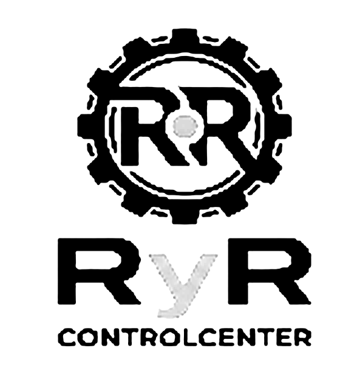

</div>

| Integrante | Rol |
|:--|:--|
| **Giuseppe Vargas Gutiérrez** | Project Manager · Analista de requerimientos |
| **Juan Camilo Parra Angarita** | DBA · Diseño de la base de datos SQLite |
| **Laura Sofia Patiño Parra** | Desarrolladora Frontend · UI/UX |
| **Cinthya Juliana Romero Muñoz** | Desarrolladora Backend · CRUD y seguridad |
| **Lauren Gabriela López Jiménez** | Especialista en Datos y Reportes (BI) |
| **Juan Esteban Tarazona Caro** | Ingeniero de Pruebas / QA |

**Cliente:** Nathalia Ramírez Durán — Ingeniería Industrial · *RyR Global*

<br>

---

<br>

<div align="center">


<br>

<sub>**RyR ControlCenter** · v1.0 · Proyecto académico inspirado en R&R Global Technical Services S.A.S.</sub>

</div>
